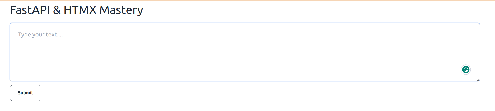

# Key👨

> Keyphrase and word extractor with AI, FastAPI and HTMX

## Use Cases

1. Content Summarization:
   Keyphrase extraction can be used to automatically generate concise and meaningful summaries of large documents or articles. By identifying and extracting key terms, the essence of the content can be captured, providing users with a quick overview.

2. Search Engine Optimization (SEO):
   Keyphrase extraction plays a crucial role in SEO by helping website owners identify and emphasize relevant keywords within their content. Optimizing content with extracted keyphrases can improve search engine rankings, making the content more discoverable to users.

3. Information Retrieval:
   In information retrieval systems, keyphrase extraction aids in organizing and categorizing documents. Extracted key terms serve as valuable metadata, facilitating faster and more accurate retrieval of relevant information from large document databases.

4. Document Clustering:
   Keyphrase extraction is beneficial in document clustering, where it helps group similar documents based on shared key terms. This can be particularly useful in organizing large datasets, improving the efficiency of data management, and enhancing the user experience when exploring related content.

5. Content Recommendation:
   By extracting keyphrases from user profiles and content preferences, keyphrase extraction algorithms can assist in building personalized content recommendation systems. This helps platforms suggest relevant articles, products, or services based on the identified key interests of individual users.
